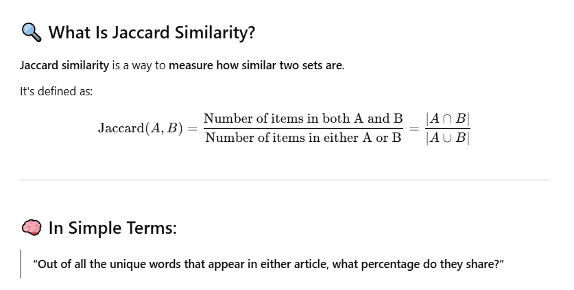
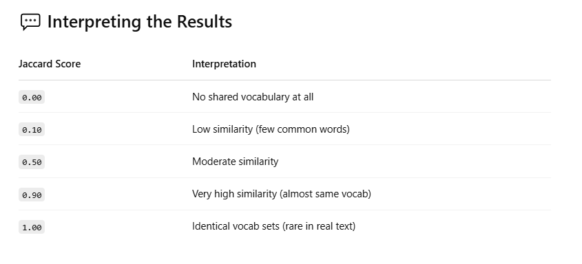
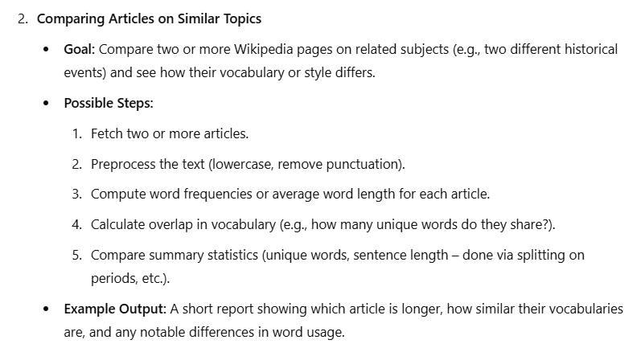
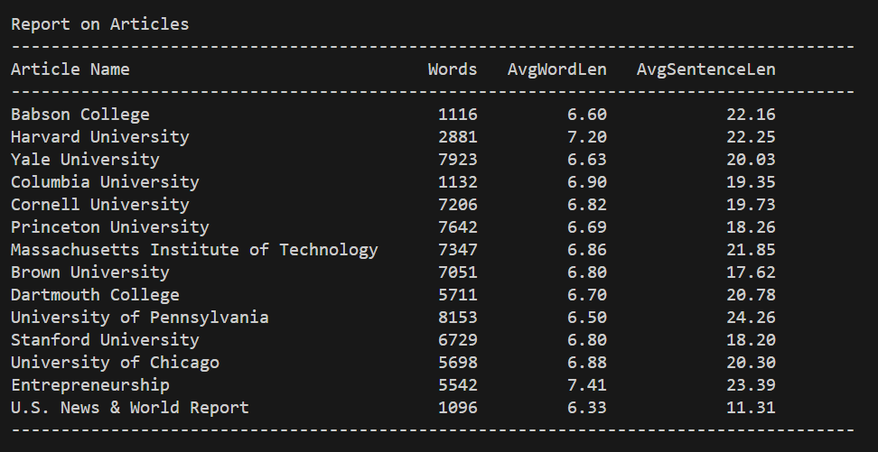
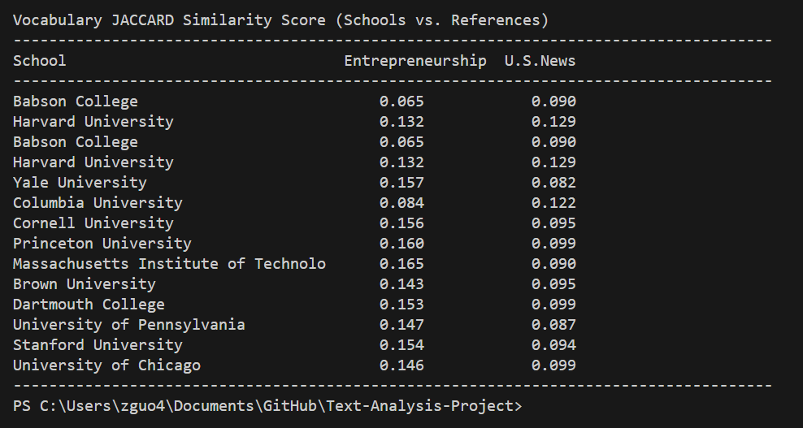

# Text-Analysis-Project

## 1. Project Overview (~1 paragraph)

What data source(s) did you use? What technique(s) did you use to process or analyze them? What did you hope to create or learn through this project?

The data sources I used in this project are wikipedia pages. Specifically, I chose wiki pages of Babson and top universities in the US and the pages "Entrepreneurship" and "US News & World Report." The techniques I used to process them include: text processing (lowercasing, punctuation removal, stop word removal, citation removal, sentence splitting), tokenization, text formatting (with the help of ChatGPT), statistics, similarity measurement using JACCARD (with the help of ChatGPT). When I was at the brainstorming stage of the project, I asked ChatGPT to come up with a list of potential prompts I can use for the project. From the prompts I received, one of them was about comparing similarities between texts, which led to the idea I used for this project. What I hoped to learn through this project is measuring how much a university emphasis is associated with (or its marketing which makes people (hence authors of wiki pages) associate it with) a certain theme. To make the project a bit easier, I only chose two themes, "entrepreneurship" and "US News & World Report," as reference. The theme "entrepreneurship" is chosen because I included Babson as one of the universities (among a list of top universities), and I wanted to see if people actually associated Babson with entrepreneurship. The other theme, US News & World Report, is chosen because I want to see how much each university brags about(or makes people pay attention to) their ranking.

## 2. Implementation (~1-2 paragraphs)

Describe your implementation at a system architecture level. You should NOT walk through your code line by line, or explain every function (we can get that from your docstrings). Instead, talk about the major components, algorithms, data structures and how they fit together. You should also discuss at least one design decision where you had to choose between multiple alternatives, and explain why you made the choice. Use shared links and/or screenshots to describe how you used GenAI tools to help you or learn new things.

To begin, I wanted to talk about my original idea which did not get executed. The first thing that came to my mind was measuring the sentiments (potitive or negative) or a certain writing, or people's sentiments regarding a certain movie (based on cinemagoer). However, when I was trying to implement my original idea, I kept having issues importing the nlkt function. Eventually, I decided to not use nlkt and choose an alternative path. One of the reasons I landed on my current idea because the goal it achieves still has some similarity to my original idea.

Looking at my project, there are four major components. The first component is a list of all the wiki pages that I intend to use for the project. I kept it separate in case I want to change the list half way through. The second component is text processing. After accessing the wiki pages, I want to process the text so that any unnecessary information is deleted. To do this, I implemented functions such as punctuation and stop word removal. The third component is building a database with all the processed texts. The dataset is going to be the based of all the calculations in the next component. The fourth component is all the calculations, including JACCARD and simple statistics.

I used GenAI in three major ways. First, I used AI in the idea generating process. I asked AI to come up with a list of topics that I can choose from, and eventually landed on an idea that interests me the most. Second, I used AI as personal tutor and asked it to go over my code line by line when an error happened. Third, I asked AI to explain the JACCARD function to me as this is a new piece of knowledge for me.

## 3. Results (~1-3 paragraphs + figures/examples)

Present what you accomplished in your project:

If you did some text analysis, what interesting things did you find? Graphs or other visualizations may be very useful here for showing your results.
If you created a program that does something interesting (e.g. a Markov text synthesizer), be sure to provide a few interesting examples of the program's output.

To begin, I want to copy the results of my text analysis: .

The first questions is: is Babson comparable to top universities? Purelly by looking at number of words, average word length, and average sentence length, the answer is not quite. While in terms of average word length and average sentence length, Babson is comparable to top universities, Babson's total words is the lowest in the list of schools (although it almost the same as Columbia University). There can be many reasons to this - history, popularity, size, etc. Because Babson has a shorter history, less popularity, and smaller size compared to all other schools on list, and because Babson outranks all the other schools on entrepreneurship, I still think they can be grouped together in comparison to the references.

The second question is: how much do schools on the list actually emphasize entrepreneurship or school ranking? (Or they make people (hence writers of their wiki page) to believe that they value these themes?) The finidng here is quite interesting. Among all the school listed, Babson is probably the one that emphasizes entrepreneurship the most, yet it received the lowest JACCARD similarty score with its association to entrepreneurship. This could have many meanings - Babson's marketing didn't convey to people (or wiki writers) how mcuh it values entrepreneurship, the outcome of Babson student's entrepreneurship projects is not great and other schools on the list have better student entrepreneurs than Babson, or other schools have a better environment for entrepreneurship although they don't market it as much. To dig into the deeper meanings would require far more sophiscated data and calculations that go beyond the scope of this project. Last but not least, all schools' JACCARD score with their association to US News is roughly the same, suggesting while all of them mention school ranking, they all mention it to a similar degree and none of them is braging about their ranking too much compared to others.

## 4. Reflection (~1-2 paragraphs)

From a process point of view, what went well? What was the biggest challenge? How did you solve it? What could you improve? Was your project appropriately scoped? Did you have a good testing plan?

From a learning perspective, what was your biggest takeaway from this project? How did GenAI tools help yo? How will you use what you learned going forward? What do you wish you knew beforehand that would have helped you succeed?

From a process point of view, the coding process itself went well. I was able to build a roadmap about who to achieve the goals I wanted for this project. In terms of writing out the codes, ChatGPT is a great tool made troubleshooting a lot easier. The biggest challenge actually turned out to be something that's not related to coding. My original idea was to do some analysis on sentiments for a text or a topic, which requires the nlkt package. I had a lot of issues downloading this package. Even with the help of ChatGPT, I still couldn't get it to work propertly, which caused me to pivot my idea. Something that I can potentially improve is probably to get to know more about computers and downloading things. Honestly, before taking this course, I never bothered to learn much about computers except for downloading games from Steam. Now that I know how much more I can do by using a computer well, I want to spend more time learning about it, so that issues like downloading something won't happen again going forward. As for the scope of the project, I intentionally limited the scope to only entrepreneurship and US News, because those are the themes that particularly interest me while I was working on the project. I believe the nature of my project allows for easy changes where someone can simply change the "Titles of Wikipedia Pages" section and get their personalized report. The testing plan itself is probably flawed, because wikipedia is probably not the best representation of a school's theme or public opinion. However, given that I wasn't able to download the nlkt package, this was a close pivoting plan that came to my mind.

From a learning perspective, my biggest takeaway from this project is the use of AI. AI tools are super helpful when you can clearly define your question, or what you want AI to do. Being able to define a question itself requires you to understand the topic - not just a little bit but quite some knowledge. When I couldn't download the nlkt package, I asked AI for assisstance. In this case, AI wasn't really helpful. One, because I couldn't ask a clear question. "It doesn't download" will not get me the answer I needed. Two, I have limited knowledge about computers. When AI gave me a solution, I couldn't understand the solution. I tried asking AI to write in simpler terms, but even to a point where AI couldn't simplify the answer anymore, I still had issues understanding the solution. Going forward, when approaching a topic that I know nothing about, I want to develop a plan where I can use AI to learn about the topic quickly, to a point where I can communicate with AI on the topic further. Last but not least, I don't think there is something that would help me succeed on this project, had I know it prior to the project. While downloading packages was an issue, I don't it's a big issue that requires a lot of attention. Besides that, everything in this project is pretty much things I know or problems that can be solved using AI. Focusing on fast learning using AI will be something I actively explore in the very near future.